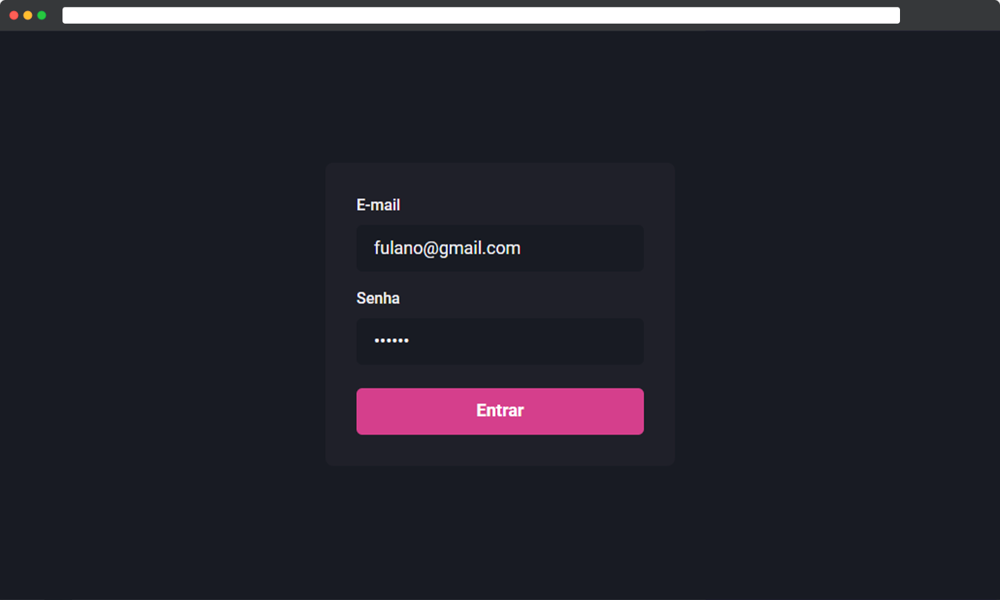

<h1 align="center"></h1>

<h3 align="center">JWT Authentication</h3>

<p align="center">“O que sabemos é uma gota. O que ignoramos é um oceano.”</p>

<p align="center">
  <a href="#about">Sobre</a>&nbsp;&nbsp;&nbsp;|&nbsp;&nbsp;&nbsp;
  <a href="#install">Instalação</a>&nbsp;&nbsp;&nbsp;|&nbsp;&nbsp;&nbsp;
  <a href="#challenge">Desafios</a>&nbsp;&nbsp;&nbsp;|&nbsp;&nbsp;&nbsp;
  <a href="#technologies">Tecnologias</a>
</p>

## :speech_balloon: Sobre <a name="about"></a>

> Essa aplicação contém toda a lógica para autenticação de usuários utilizando JWT.

<br />
<table>
  <tr>
    <td colspan="1">SignIn</td>
  </tr>
  <tr>
    <td></td></td>
  </tr>
</table>

## :warning: Instalação <a name="install"></a>

```bash
# Em ambos os diretórios:
$ cd backend e frontend

# Instalar as dependências necessárias:
$ yarn

# Iniciar o projeto:
$ yarn dev

# Usuários:
$ fulano@gmail.com e beltrano@gmail.com

# Senha:
$ 123456
```

## :triangular_flag_on_post: Desafio <a name="challenge"></a>

> Aprender a utilização de JWT e aplicar estilização com Chakra.

## :heavy_check_mark: Tecnologias <a name="technologies"></a>

- [JWT](https://jwt.io/)
- [Next](https://nextjs.org/)
- [React](https://pt-br.reactjs.org/)
- [Chakra](https://chakra-ui.com/)
- [TypeScript](https://www.typescriptlang.org/)

---

by [Douglas Scaini](https://www.github.com/douglasscaini) ❤️
